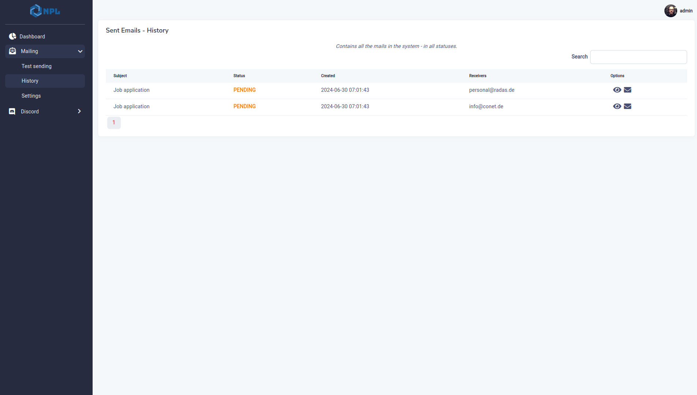
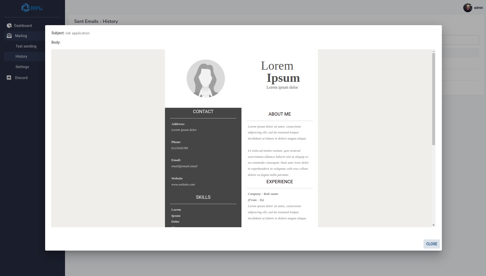

<h1 align="center">Message Hub</h1>

<p align="center">

</p>

<div align="center">


</div>

<div align="center">
This project is a part of: <b><a href="https://github.com/Volmarg/voltigo-frontend">Voltigo</a></b>
</div>

## Description

<hr>
<p align="justify">
	This project is used as a central point to sending out messages, it's based on some older project of mine, thus it also supports
Discord Webhooks.
</p>

## Preview



<hr>	



## Running the project

- make sure that **mailer** is running, You can use already prepared mailer project from <a href="https://github.com/Volmarg/voltigo-mailpit">here</a>
- make sure that **database container** is running, You need to either provide Your own one or create `docker-compose` with this content

```yaml
# This should work for all backend projects
services:

  db:
    container_name: voltigo-projects-databases  
    image: mysql:latest
    restart: always
    tty: true    
    environment:
      MYSQL_ROOT_PASSWORD: root
    extra_hosts:
      - "host.docker.internal:host-gateway"      
    volumes:
      - db:/var/lib/mysql   
    ports:
      - 3661:3306

volumes:
  db:
```

- go inside the `docker` directory,
- call `docker-compose -f docker-compose-prod.yaml up -d`,
- the project is now reachable:
    - locally under: `127.0.0.1:8006`
    - within other voltigo-related containers under: `host.docker.internal:8006` 

## Creating account

- go to start page (`/`) and click `register`,
- set user and password and confirm, 
- all is ready (no confirmation email is sent etc.),
- you can now log in,